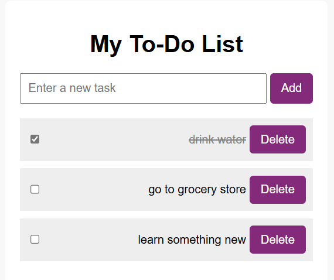

# PHP To-Do List 📝

This is a to-do list application built with PHP, HTML, and CSS. It uses session storage to manage tasks without a database.

## Features
- Add tasks
- Mark tasks as complete
- Delete tasks
- Uses PHP sessions to store tasks temporarily

## Screenshot



## How to Run
1. Make sure PHP is installed.
2. In your terminal, navigate to the project folder and run:  
   ```bash
   php -S localhost:8000
3. Open your browser and go to: `http://localhost:8000`

### Done! 
- Type in your task for the day!